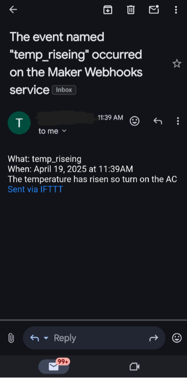

# 🏠 IoT Home Automation System

This project demonstrates a **smart home system** using **ESP8266 (NodeMCU) + DHT11 sensor + Arduino IoT Cloud + IFTTT**.  
It allows users to **monitor temperature & humidity in real time** and **control appliances remotely** through a cloud dashboard.

---

## 🚀 Features
- 🌡️ Real-time temperature & humidity monitoring  
- 💡 Remote control of appliances (LED in this project) via Arduino IoT Cloud  
- 📲 Automatic alert via IFTTT when temperature exceeds a threshold  
- 🌐 Cloud-based monitoring & data logging  
- ⚡ Scalable and customizable for more devices  

---

## 🛠️ Components Used
- **NodeMCU ESP8266**  
- **DHT11 Sensor** (Temperature & Humidity)  
- **LED** (as a controllable appliance)  
- **Arduino IoT Cloud** (for dashboard and remote access)  
- **IFTTT** (for notifications)  

---

## ⚡ How It Works
1. The **ESP8266 (NodeMCU)** connects to WiFi and links with **Arduino IoT Cloud**.  
2. The **DHT11 sensor** continuously measures **temperature & humidity** every 5 seconds.  
3. If temperature goes **above 31°C**, an **alert is triggered**. This can be done in two ways:  

   ### Option A: Using Code (sendToIFTTT function)  
   - Write a small HTTP request in your code to send the temperature value to IFTTT.  
   - IFTTT then forwards the alert to services like Gmail, Telegram, or SMS.  

   ### Option B: Using Arduino IoT Cloud Webhooks (No Code)  
   - Arduino IoT Cloud has a built-in **Webhook integration**.  
   - You can easily set it up in a few steps:  
     1. Go to **Arduino IoT Cloud → Integrations → Webhooks**.  
     2. Click **Create Webhook** and paste the Webhook URL (from IFTTT, Telegram, Slack, etc.).  
     3. Name it (e.g., `High Temp Alert`) and select the data you want to send (e.g., `temperature`).  
     4. Go to your **Thing** → add a **Trigger** (`if temperature > 31°C`).  
     5. Select **Webhook Action** and choose your created Webhook.  

   ✅ Now, whenever the condition is met, Arduino IoT Cloud automatically fires the Webhook and sends you a notification — no extra code needed!  

4. The **LED** is linked to a cloud variable. You can toggle it **ON/OFF remotely** from the Arduino IoT Cloud dashboard.  
5. All sensor values are logged and **displayed in real-time** on the cloud dashboard, accessible via web or mobile app.  
## 🔧 Step-by-Step Setup (Connect ESP8266 to Arduino IoT Cloud)

Follow these steps to set up your NodeMCU (ESP8266) with Arduino IoT Cloud:

### 1. Install Required Tools
- Install the **Arduino IDE** from [arduino.cc](https://www.arduino.cc/en/software).  
- In Arduino IDE, go to **File → Preferences → Additional Board Manager URLs** and add:  
http://arduino.esp8266.com/stable/package_esp8266com_index.json?utm_source=chatgpt.com
- Then go to **Tools → Board → Board Manager**, search for **ESP8266**, and install it.  

---

### 2. Set Up Arduino IoT Cloud
- Go to [Arduino IoT Cloud](https://create.arduino.cc/iot).  
- Log in with your Arduino account.  
- Click **Create Thing**.  
- Add **Device** → Select **Set up a 3rd Party Device** → Choose **ESP8266** → **NodeMCU 1.0 (ESP-12E Module)**.  
- Save the **Device ID** and download the **Secret Key** when prompted.  

---

### 3. Define Cloud Variables
Inside your **Thing**, add variables like:
- `float temp` → Temperature (Read Only).  
- `float humid` → Humidity (Read Only).  
- `bool lED` → LED control (Read & Write).  

These will sync automatically with your code through `thingProperties.h`.  

---

### 4. Generate Thing Sketch
- Arduino IoT Cloud automatically generates a **Sketch** with a `thingProperties.h` file.  
- Download the sketch and open it in Arduino IDE.  
- Replace the loop with your sensor logic (like in `HomeAutomation.ino`).  

---

### 5. Upload Code to ESP8266
- Connect your **NodeMCU ESP8266** via USB.  
- In Arduino IDE, select:  
- **Board**: NodeMCU 1.0 (ESP-12E Module).  
- **Port**: The COM port of your ESP8266.  
- Click **Upload**.  

--

### 6. Create a Dashboard
- In Arduino IoT Cloud, go to **Dashboards → Create Dashboard**.  
- Add widgets:  
- **Gauge** for Temperature.  
- **Gauge** for Humidity.  
- **Switch** for LED control.  
- Link each widget to the variables you created (`temp`, `humid`, `lED`).  
### . Arduino IoT Cloud Dashboard
Dashboard showing real-time temperature, humidity, and LED control.  

---

### 7. (Optional) Add Webhooks for Alerts
- Go to **Integrations → Webhooks**.  
- Create a Webhook (e.g., IFTTT, Telegram, or Email).  
- Add a **Trigger** in your Thing: `if temperature > 31°C → send Webhook`.  
### . IFTTT Alert Notification
Example of an alert received when temperature goes above 31°C.  

---

✅ Done! Your ESP8266 will now send sensor values to the Arduino IoT Cloud, and you can monitor/control everything via the **Web Dashboard** or the **Arduino IoT Remote app** (available on Android & iOS).  

---

